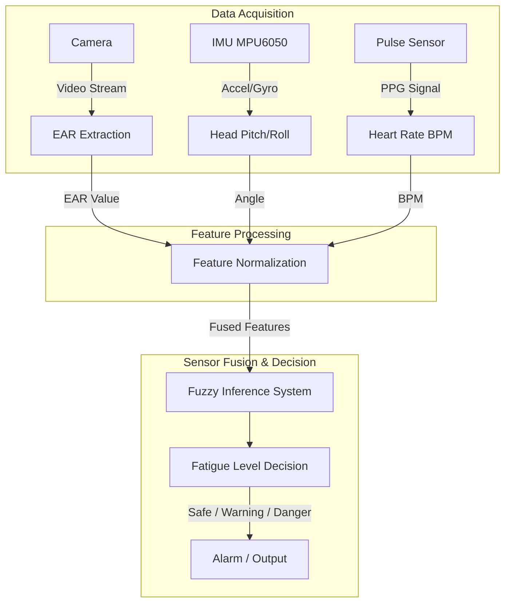
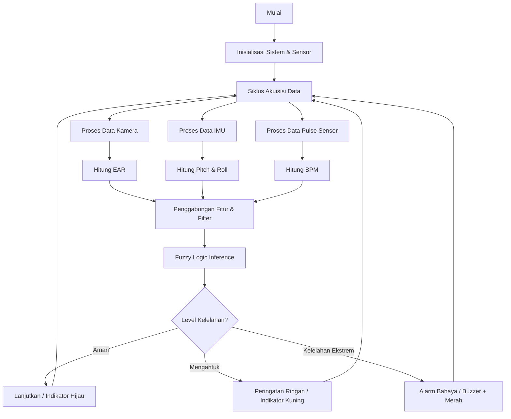
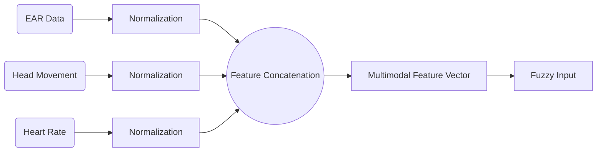
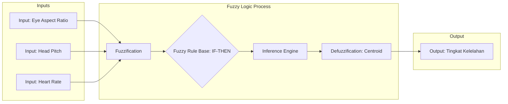
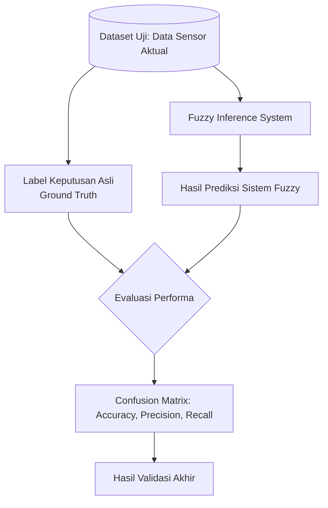

# Dokumentasi Gambar Sistem Deteksi Kelelahan

Berikut adalah diagram dan gambar pendukung yang Anda butuhkan untuk dokumentasi atau pelaporan proyek deteksi kelelahan Anda.

## 1. Arsitektur Model Deteksi Kelelahan Berbasis Sensor Fusion

**Penjelasan Singkat:**  
Diagram arsitektur ini menunjukkan aliran keseluruhan sistem. Tiga sumber sensor (Kamera, IMU, Pulse Sensor) diakuisisi secara paralel. Data mentah tersebut kemudian diekstrak menjadi nilai fitur diskrit (EAR, *Pitch/Roll*, BPM), dinormalisasi, dan akhirnya digabungkan (fusi) sebagai masukan untuk dievaluasi oleh sistem *Fuzzy Logic* penentu tingkat kelelahan.

---

## 2. Implementasi Sensor pada Wearable Smart Helmet
Berikut adalah konsep visual implementasi sensor pada helm cerdas. Kamera ditempatkan pada visor depan, sensor detak jantung di area bantalan telinga/pipi, dan IMU di dalam modul sistem.


**Penjelasan Singkat:**  
Ilustrasi ini menggambarkan tata letak fisik *hardware* pada helm *wearable*. Kamera mini difokuskan ke arah area mata pada bagian dalam visor, modul IMU terpasang pada bagian belakang atau atas helm untuk mendeteksi orientasi kepala, dan sensor detak jantung disematkan di dalam bantalan spons agar bersentuhan dengan kulit pengguna.

---

## 3. Diagram Alir Kerja Sistem Deteksi Kelelahan

> [!NOTE]
> **Penanganan Sensor Gagal:** Jika pada siklus akuisisi terdapat kegagalan pembacaan pada salah satu sensor (misalnya sensor terputus sementara, sinyal *noise*, atau belum ada data baru), sistem tidak akan terhenti (*blocking*). Sistem dirancang untuk menggunakan **nilai default** atau **nilai pembacaan terakhir yang valid**, sehingga proses *Fuzzy Inference* dapat terus berjalan tanpa hambatan.

**Penjelasan Singkat:**  
Diagram alir (flowchart) ini merepresentasikan siklus *looping* berkelanjutan pada mikrokontroler. Setelah sistem dan sensor diinisialisasi, sistem secara terus-menerus menarik data dari ketiga sensor, melakukan ekstraksi fitur, mengevaluasinya dalam sistem logika *Fuzzy*, dan merespons dengan indikator aman, peringatan ringan, atau alarm peringatan bahaya mengantuk ekstrem.

---

## 4. Skema Sensor Fusion Pada Level Fitur

**Penjelasan Singkat:**  
Skema fusi ini menyoroti bahwa penggabungan data terjadi pada tingkat fitur (*Feature-Level Fusion*). Daripada menggabungkan data mentah atau keputusan akhir secara independen, nilai fitur spesifik (EAR, kemiringan kepala, BPM) terlebih dahulu dinormalisasi dan di-*concatenate* menjadi sebuah vektor multidimensi sebelum dievaluasi bersamaan oleh sistem *Fuzzy*.

---

## 5. Struktur Fuzzy Inference System (FIS)

**Penjelasan Singkat:**  
Diagram ini memperjelas struktur internal *Fuzzy Inference System* (FIS). Input sensor bertipe numerik (*crisp inputs*) dikonversi menjadi kategori linguistik (*Fuzzification*), lalu dianalisis menggunakan aturan logika pakar atau *Rule Base* (contoh: JIKA mata tertutup DAN detak jantung rendah MAKA kelelahan ekstrem). Hasil penalaran logika tersebut (*Inference Engine*) kemudian dipetakan kembali menjadi persentase nilai pasti tingkat kelelahan (*Defuzzification*) untuk memicu keputusan sistem.

---

## 6. Hasil Tampilan / Log Deteksi Sistem (Data Riil yang Diproses)
```log
[00:00:27] SENSOR DATA -> Risk Score: 39.74% | Alert Level: 1 | STATUS: WARNING (DROWSY)
[00:00:28] SENSOR DATA -> Risk Score: 27.81% | Alert Level: 0 | STATUS: NORMAL (SAFE)
... (beberapa waktu kemudian saat pengendara mulai mengantuk) ...
[00:02:57] SENSOR DATA -> Risk Score: 74.83% | Alert Level: 2 | STATUS: DANGER (MICROSLEEP!) -> BUZZER ON
[00:02:58] SENSOR DATA -> Risk Score: 74.55% | Alert Level: 2 | STATUS: DANGER (MICROSLEEP!) -> BUZZER ON
```
**Penjelasan Singkat:**  
Tampilan log di atas merupakan hasil proses (*parsing*) dari **data riil murni** (*sensor_data.csv*) yang direkam dari pengujian *hardware* helm cerdas. Daripada menampilkan data angka mentah, sistem atau antarmuka aplikasi mengonversinya menjadi teks yang ramah baca (*human-readable*). Baris ini secara *real-time* menampilkan persentase skor risiko kelelahan (*Risk Score*) dan bereaksi memicu alarm ketika persentasenya menembus batas kritis yang mengubah *Alert Level* menjadi tingkat Bahaya (2).

---

## 7. Grafik Denyut Jantung, Kedipan Mata, dan Gerakan Kepala


**Penjelasan Singkat:**  
Grafik simulasi sensor ini memetakan transisi data fisik pengendara dari kondisi segar menuju kelelahan. Sesaat setelah *Fatigue Onset* (kondisi mengantuk), grafik mengilustrasikan perubahan parameter klinis: terjadi penurunan nilai detak jantung (BPM), durasi pelebaran mata yang lebih pendek dengan kedipan lama pada *Eye Aspect Ratio* (EAR), serta ayunan kurva yang lebar pada sumbu *Head Pitch* akibat peristiwa kepala tertunduk.

---

## 8. Skema Pengujian Akurasi Fuzzy Inference System

**Penjelasan Singkat:**  
Skema validasi ini ditujukan untuk memverifikasi keandalan sistem *Fuzzy Logic* yang telah dibuat. Dataset pengujian (data dari pengemudi) dimasukkan ke dalam sistem *Fuzzy*, yang kemudian akan mengeluarkan prediksi tingkat kelelahan. Prediksi dari sistem ini selanjutnya dicocokkan dengan label/kejadian sebenarnya (*Ground Truth*). Tingkat keberhasilan sistem (*akurasi, presisi, recall*) kemudian dihitung menggunakan metode *Confusion Matrix* untuk membuktikan seberapa valid aturan *Fuzzy* yang digunakan pada proyek ini.
