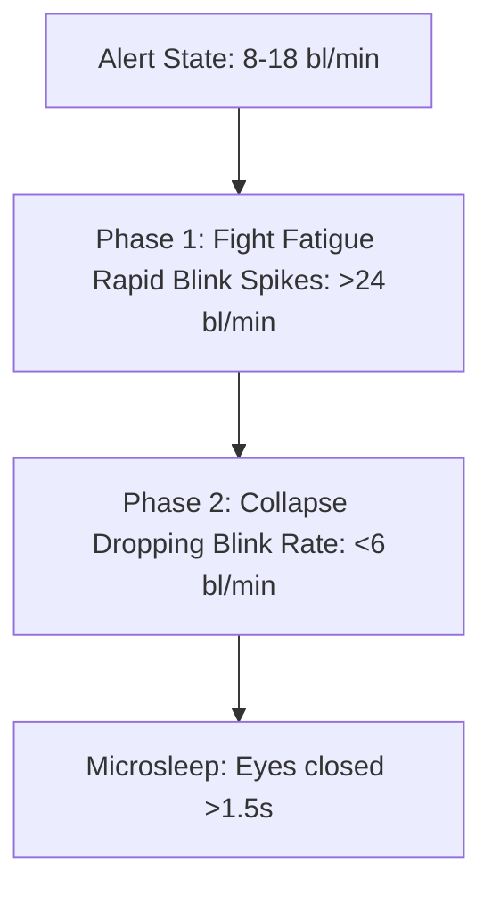

# IoT Fatigue Helmet: Thresholds & Scientific Sources Walkthrough

This document compiles the detection thresholds designed for the IoT Fatigue Helmet, providing the physiological justification and mapping each rule to its scientific source (the empirical datasets and published journals in the `dataset & teory` folder).

---

## 1. Heart Rate & Heart Rate Variability (HRV) Thresholds

Unlike eye movements, heart rate changes reflect Autonomic Nervous System (ANS) activity. The direction of change depends on whether the user is facing **acute cognitive stress** or **cumulative Time-on-Task (ToT) mental fatigue**.

### Understanding the Autonomic Nervous System (ANS)
The ANS automatically controls involuntary body functions like heart rate and breathing. It operates via two opposing branches:
*   **Sympathetic Nervous System (SNS) — "The Gas Pedal" (Fight-or-Flight):** Activates under physical exertion, cognitive stress, or danger. It pumps adrenaline, speeds up the heart, and increases alertness.
*   **Parasympathetic Nervous System (PNS) — "The Brake Pedal" (Rest-and-Digest):** Activates during safety, rest, and sleep. Controlled primarily by the Vagus nerve, it slows the heart down and conserves the body's energy.

### Physiological Behavior & Threshold Basis

#### 1. Alert State (Normal): Baseline ± 10%
*   **Physiological Basis:** When alert and driving normally, the heart fluctuates within a narrow range (typically 70–80 BPM). These minor variations are caused by breathing (respiratory sinus arrhythmia) and active driving movements. The $\pm 10\%$ threshold accommodates this normal, healthy biological noise without triggering false alarms.

#### 2. Acute Stressed / High Cognitive Load: > 115% of Baseline
*   **Physiological Basis:** When facing high mental workload (e.g., complex navigation or traffic danger), the **Sympathetic (SNS)** system activates. Adrenaline overrides the vagal control, causing the heart rate to surge. 
*   **Threshold Justification:** In the *MePhy* dataset, resting baseline was **77.9 BPM**, which spiked to **89.1 BPM** (+14.4%) under combined stress. Setting a threshold at $> 115\%$ of baseline successfully isolates acute sympathetic stress from normal driving fluctuations.

#### 3. Drowsiness / Sleep State: > 10% to 15% Drop from Baseline
*   **Physiological Basis:** As a driver gets sleepy or disengaged (cumulative Time-on-Task), the **Parasympathetic (PNS)** system dominates. The Vagus nerve sends electrical impulses that actively slow down the firing rate of the heart's sinoatrial node, pulling the heart rate below its normal alert range.
*   **Threshold Justification:** A drop of $10\%$ to $15\%$ below the rider's average alert heart rate is a clear indicator that parasympathetic vagal tone has suppressed normal alert function.
*   **Optional/Advanced HRV Trend:** Prolonged fatigue leads to task disengagement, triggering an increasing trend in time-domain HRV metrics (**RMSSD** and **SDNN**) and Poincaré plot metrics (**SD1** and **SD2**) as the heart beats with more relaxed, high-variability intervals.

### Scientific Sources
1.  **MePhy Dataset (ECG, N=60):** 
    *   *Baseline (Resting):* **77.9 ± 11.2 BPM**
    *   *Cognitive Load Fatigue:* **84.3 ± 10.9 BPM** (sympathetic activation / increase)
    *   *Combo Physical & Cognitive Fatigue:* **89.1 ± 13.8 BPM**
2.  **FatigueSet Dataset (Wrist PPG, N=12):**
    *   *Low Intensity (Alert baseline):* **79.3 ± 9.4 BPM**
    *   *Medium Intensity:* **85.3 ± 6.1 BPM**
    *   *High Intensity:* **90.2 ± 13.0 BPM**
    *   *Takeaway:* Confirms that cognitive/physical exhaustion triggers a sympathetic heart rate increase, opposite to drowsiness.
3.  **Csathó et al. 2024 (Biological Psychology Systematic Review) [Optional/Advanced]:**
    *   Analyzes 19 controlled experimental studies on Time-on-Task (ToT) induced mental fatigue.
    *   Finds that Time-on-Task typically induces a **consistent increasing trend** in time-domain HRV indices (particularly **RMSSD** and **SDNN**, found in 7/10 studies) and non-linear Poincaré metrics (**SD1** and **SD2**, found in 4/4 studies), reflecting enhanced parasympathetic (vagal) activation.
    *   LF power also consistently **increases** with Time-on-Task in complex tasks (7/10 studies).
    *   Notes that the **LF/HF ratio** is highly variable and only increased in simulated driving/flight tasks (2/6 studies), showing no change in other cognitive tasks.
4.  **Guo et al. 2025 (Frontiers in Neuroscience) [Optional/Advanced]:**
    *   Demonstrates that **12 selected HRV features** (Mean HR, Mean RR, SDNN, RMSSD, pNN50, pNN20, LF, HF, LF/HF, LFn, HFn, SD1/SD2) are statistically significant markers ($p < 0.05$ or $p < 0.01$) for 3-level fatigue classification (Non-fatigue, Mild fatigue, Severe fatigue).
    *   Achieves **88.6% accuracy** in classification using LightGBM on wearable ECG/HRV data.
5.  **MPD-DF Paper (Scientific Data 2026):**
    *   Establishes that deep-learning classification using a 10-second ECG window yields **82.4% accuracy** in distinguishing alert vs. fatigued drivers, validating the strong correlation of cardiovascular features with sleepiness.
6.  **Freitas et al. 2024 (Systematic Review):**
    *   Analyzes 71 papers, showing that 80% used ECG and 28% used PPG (mostly wrist-worn). It highlights that PPG-based HR is popular and convenient, but warns that **motion artifacts** (highly relevant to motorcycle riding) and skin contact issues can degrade signal quality, necessitating robust signal filtering.

### Detection Rules for the Helmet

*Note: Drowsiness does not have a single hardcoded BPM limit due to individual resting HR variations; instead, it is assessed as a relative decrease from the rider's personal baseline. Advanced HRV metrics are marked as optional to simplify early firmware implementation.*

| State | Core Heart Rate Rule (Simple) | Advanced HRV Rule (Optional) | Interpretation | Source |
|:---|:---|:---|:---|:---|
| **Alert (Normal)** | Baseline ± 10% | Steady HRV baseline | Normal active variation | Baseline extraction from MePhy / FatigueSet |
| **⚠️ High Cognitive Load** | **> 115% of baseline** | Elevated LF/HF ratio | High stress / mental workload (not drowsy) | MePhy / FatigueSet / Guo et al. 2025 / Csathó et al. 2024 |
| **⚠️ Drowsiness** | **> 10-15% drop in HR** from personal baseline | Increasing trend in RMSSD, SDNN, SD1, and SD2 | Autonomic shift to parasympathetic dominance | Guo et al. 2025 / Freitas et al. 2024 / Csathó et al. 2024 |

---

## 2. Respiration Rate Thresholds

Respiratory patterns are tightly coupled with the driver's cognitive state and physical fatigue levels.

### Physiological Behavior
*   **Alert/Stressed State:** Higher mental load or physical exertion causes faster, shallower breathing.
*   **Drowsy State:** As the driver relaxes towards sleep, respiration rate slows down, and breathing becomes highly regular and consistent with decreased respiratory variability.

### Scientific Sources
1.  **Guo et al. 2025:**
    *   Identifies mean respiration rate (`MeanRsp`) as a statistically significant indicator ($p < 0.001$) across three levels of flight fatigue.
    *   Proves that fusing `MeanRsp` with HRV features yields the highest overall classification accuracy.
2.  **MPD-DF Paper (2026):**
    *   Shows that a classifier using 10-second thoracic respiratory effort (RES) signals alone achieves **82.8% accuracy** in identifying driver fatigue, outperforming the 10-second ECG classifier (82.4%).

### Detection Rules for the Helmet

*Note: Since the helmet does not have a dedicated chest strap, respiration rate (`MeanRsp`) will be extracted as PPG-Derived Respiration (PDR) from the raw pulse sensor signal by filtering the amplitude and frequency modulation of the pulse waves.*

| State | Respiration Rule | Interpretation | Source |
|:---|:---|:---|:---|
| **Alert (Normal)** | 12–20 breaths/min | Normal resting/active breathing | Guo et al. 2025 / MPD-DF 2026 |
| **⚠️ High Cognitive Load** | **> 22 breaths/min** | Stressed, hyperventilating, or active physical exertion | Guo et al. 2025 |
| **🚨 Drowsiness** | **< 10 breaths/min** OR highly regular, low-variability respiration | Respiration rate drop during sleep transition | MPD-DF 2026 |

---

## 3. Blink Rate (EOG / Video EAR) Thresholds

Blinking is the primary visual metric for fatigue. It follows a non-linear **two-phase pattern** as a driver struggles against sleep.

### Physiological Behavior
*   **Phase 1 (Fight Fatigue):** The driver actively fights drowsiness. They perform rapid, consecutive blinking bursts to force their eyes open and clear their vision.
*   **Phase 2 (Collapse):** The compensatory mechanism fails. The motor control of the eyelids degrades, leading to a sharp drop in blink frequency and prolonged staring.

### Scientific Sources
1.  **Divjak 2009 (Webcam, Page 2-4):**
    *   *Normal Baseline:* **18 ± 3 blinks/min**
    *   *Fatigued State:* **8 ± 1 blinks/min** (a **56% decrease**)
    *   *Fight Behavior:* *"We noticed that people tend to fight eye fatigue by short bursts of rapid blinking..."*
2.  **IICIP 2016 (Matlab Video, Page 1, Page 3-4):**
    *   *Normal Driving Baseline:* **8–10 blinks/min** (naturally lower than resting due to focused road visual attention).
    *   *Sleep-Deprived Fatigue:* **4–6 blinks/min** (a **~40–50% decrease**).
    *   *Threshold Rule:* Warns if the blink rate goes either *"higher or lower than the range of threshold"*—confirming that abnormal spikes (Phase 1 struggle) are also fatigue markers.

### Detection Rules for the Helmet

| State | Blink Rate Rule | Interpretation | Source |
|:---|:---|:---|:---|
| **Alert (Normal)** | 8–18 blinks/min | Normal visual attention for driving | IICIP 2016 (8-10 bl/min) / Divjak 2009 (18 bl/min) |
| **⚠️ Phase 1 Warning (Fight)** | **> 24 blinks/min** OR short rapid bursts | Active struggle against eye strain / drowsiness | **Divjak 2009**: *"people tend to fight eye fatigue by short bursts of rapid blinking"* |
| **🚨 Phase 2 Critical (Collapse)** | **< 6 blinks/min** | Driver is collapsing towards sleep | **Divjak 2009**: Fatigued state at 8 blinks/min. **IICIP 2016**: Fatigued state at 4-6 blinks/min. |

---

## 4. Eye Closure Duration (PERCLOS) Thresholds

PERCLOS (Percentage of Eye Closure) measures the proportion of time the eyes are closed over a specific window (typically 1 minute). It is widely regarded as the most reliable ocular metric for drowsiness.

### Physiological Behavior
*   **Alert State:** Blinks are extremely fast (typically 100–300 ms). The eyes are open more than 95% of the time.
*   **Drowsy State:** Eyelids droop, blinking becomes sluggish, and the duration of each blink increases. Eventually, the eyes close for seconds at a time (microsleeps).

### Scientific Sources
1.  **Divjak 2009 (Page 2):**
    *   *Average Eye Closure Duration (AECD):* Increases by **25–40%** in fatigued subjects.
2.  **MPD-DF Paper (2026):**
    *   Shows that an EOG/video-based closure classification model achieves **83.1% accuracy** in identifying driver fatigue, validating PERCLOS as a primary visual metric.

### Detection Rules for the Helmet

| State | PERCLOS / Eye Closure Rule | Interpretation | Alert Action |
|:---|:---|:---|:---|
| **Alert (Normal)** | < 15% eye closure over 60s | Normal eye open-state | None |
| **⚠️ Moderate Fatigue** | 15% – 30% eye closure over 60s | Drooping eyelids / slow blinking | Single beep reminder |
| **🚨 Emergency (Microsleep)** | **> 80% eye closure for > 2 seconds** OR **PERCLOS > 40% over 60s** | Eyes closed / Microsleep occurring | Critical continuous alarm |

---

## 5. Head Movement (IMU) Thresholds

The MPU-6050 accelerometer/gyroscope measures physical head dynamics, capturing the motor control loss associated with sleep.

### Physiological Behavior
*   **Alert State:** Minor, active head adjustments. Steady, low-variance angular velocity.
*   **Stressed State:** High cognitive or physical workload triggers fidgeting, shifting, or erratic movements, causing gyro variance to spike.
*   **Drowsy State:** Eyelid droop is followed by motor control loss in the neck muscles. The driver's head exhibits **nodding behavior** (rhythmic forward and backward micro-adjustments as they fight sleep) and a high **head-tilted ratio** (the head tilting forward or dropping downward limply).

### Scientific Sources
1.  **FatigueSet Dataset (Nokia eSense Earable & Muse S Gyroscopes, N=12):**
    *   *Low Intensity (Alert baseline):* Forehead gyro variance ~143. Earable gyro variance ~274–382.
    *   *High Intensity (Stressed):* Forehead gyro variance spikes to ~250. Earable gyro variance explodes to **1200–5000+**.
    *   *Takeaway:* Stressed/exerted states trigger intense fidgeting and erratic head movements, causing massive spikes in angular velocity variance. The ear-level placement (similar to our helmet side-mount) acts as an amplifier for these movements.
2.  **Alparslan et al. (Towards Evaluating Driver Fatigue):**
    *   Explicitly notes that as sleepiness fatigue sets in, the **"heads start to fall down"** (Page 2).
    *   Concludes that researchers must **"explore the relative head position in order to better detect the driver's fatigue"** (Page 7).
3.  **Freitas et al. 2024 (Systematic Review):**
    *   Explicitly identifies head position as a key postural fatigue marker:
        *   **Page 9:** *"In terms of data extracted from body posture, the most common features include nodding, head-tilted ratio, head posture and movement..."*
        *   **Page 17:** *"Only four studies... evaluated the body posture of drivers, specifically focusing on nodding behavior and body movements. While this approach could provide insights into the driver's fatigue state, it is important to note that relying solely on these features is insufficient for accurately predicting and estimating fatigue."*

### Detection Rules for the Helmet

| State | IMU Rule | Interpretation | Source |
|:---|:---|:---|:---|
| **Alert (Normal)** | Steady low-variance gyro | Normal driving posture | FatigueSet (Low intensity baseline) |
| **⚠️ High Cognitive Load** | Gyro variance **> 1200** (ear-level) | Fidgeting / frustration under stress | **FatigueSet**: Earable variance spikes > 4x to 10x |
| **🚨 Critical Warning (Head Drop / Tilt)** | Pitch angle drops continuously downwards (> 25° forward tilt) and remains still | Neck muscle relaxation / "Head fall" / Head tilting | **Alparslan (Page 2)** / **Freitas et al. 2024 (Page 9, 17)** |

---

## 6. Multi-Sensor Fusion & Fuzzy Logic Mapping

To prevent false alarms and provide a smooth, reliable warning system on the ESP32-S3-CAM, the verified thresholds can be mapped into a **Fuzzy Inference System (FIS)**. This is computationally lightweight and runs efficiently at the edge.

### Fuzzy Membership Functions (FIS Design)

1.  **Input 1: Heart Rate Deviation (`HR_Diff`)**
    *   `Dropped`: $\le -10\%$ from baseline
    *   `Stable`: $-9\%$ to $+10\%$ from baseline
    *   `Elevated`: $\ge +15\%$ from baseline
    *   *(Note: Advanced users can optionally replace this with `HR_Vagal_Trend` incorporating RMSSD/SDNN/SD1/SD2 features to represent vagal tone shifts).*
2.  **Input 2: Eye Aperture (`EAR_PERCLOS`)**
    *   `Closed` (Microsleep): $\ge 40\%$ PERCLOS over 60s OR continuous closure $> 1.5s$
    *   `Sluggish` (Blink transition): $15\% - 30\%$ PERCLOS OR blink rate $< 6\text{ bl/min}$
    *   `Open` (Alert): $< 15\%$ PERCLOS AND blink rate $8 - 18\text{ bl/min}$
3.  **Input 3: Head Motion (`IMU_State`)**
    *   `Limp` (Head-Drop): Pitch tilt $\ge 25^\circ$ forward with low variance
    *   `Fidgety` (Stressed): Gyro variance $\ge 1200$
    *   `Stable` (Normal): Gyro variance $< 400$
4.  **Output: Fatigue Risk (`Risk_Score`)**
    *   `Safe`: $0\% - 30\%$ $\rightarrow$ Green (No alarm)
    *   `Warning`: $31\% - 70\%$ $\rightarrow$ Yellow (Single warning beep / haptic buzz)
    *   `Critical`: $71\% - 100\%$ $\rightarrow$ Red (Continuous alarm buzzer)

### Fuzzy Logic Rule Base

*   **Rule 1 (Normal Alert Driving):**
    `IF HR_Diff is Stable AND EAR_PERCLOS is Open AND IMU_State is Stable THEN Risk_Score is Safe`
*   **Rule 2 (Drowsiness/Microsleep Collapse):**
    `IF HR_Diff is Dropped AND EAR_PERCLOS is Closed THEN Risk_Score is Critical`
*   **Rule 3 (Head Drop Drowsiness):**
    `IF EAR_PERCLOS is Closed AND IMU_State is Limp THEN Risk_Score is Critical`
*   **Rule 4 (Early-Stage Struggle):**
    `IF EAR_PERCLOS is Sluggish AND HR_Diff is Dropped THEN Risk_Score is Warning`
*   **Rule 5 (High Cognitive Stress / Stressed Fatigue):**
    `IF HR_Diff is Elevated AND IMU_State is Fidgety THEN Risk_Score is Warning`
    *(Helps prevent false drowsiness alarms when the driver is simply active or navigating traffic)*

---

## 7. Engineering Assumptions & Implementation Decisions

While the primary thresholds are derived from literature, several specific values and behaviors in the firmware are practical engineering choices made to optimize the system for the physical realities of the ESP32-S3 hardware and the motorcycle riding environment:

1. **Nodding Frequency Band (0.5–2.0 Hz)**
   * **Reasoning:** Human head nodding during micro-sleeps typically falls into this low-frequency band. The 6-second rolling buffer (60 samples at 10 Hz) captures enough context for detrending without introducing excessive latency.
2. **ZCR Normalization Divisor (4.0)**
   * **Reasoning:** Used to map the Zero-Crossing Rate (ZCR) of detrended pitch into a [0, 1] `Nod_Score`. The divisor 4.0 assumes a maximum reasonable "fatigued nod" rate of ~2 Hz (4 zero-crossings per second). Faster shaking is gated out or clamped.
3. **Default Blink Fallback (13.0 blinks/min)**
   * **Reasoning:** If the Python serial pipeline disconnects or is never launched, the blink rate defaults to exactly 13.0. This is dead-center in the `Normal` membership function (flat-top between 10-16). **Decision:** Maximally conservative; it ensures that a disconnected camera does not trigger a false `Warning` or `Critical` alarm, allowing the FIS to continue operating smoothly on IMU and HR data alone.
4. **Baseline HR ($N=20$ cumulative valid samples)**
   * **Reasoning:** It takes roughly 20 valid beats to establish a stable resting heart rate.
   * **Implementation Behavior:** The counter is **cumulative**, not consecutive. If the pulse sensor loses contact briefly (signal noise), the system pauses counting but does not reset. This is essential for a moving environment where brief sensor dropouts are common; resetting consecutively would cause the baseline to rarely form.
5. **`gyro_Fidgety` Rise Start (750 instead of 800)**
   * **Reasoning:** The `Fidgety` membership function was slightly adjusted to begin rising at a variance of 750 (rather than 800) to ensure proper overlap with the `Stable` function (which fades down to 1000). This mathematical overlap ensures that the Mamdani centroid doesn't break or jump abruptly between states.
